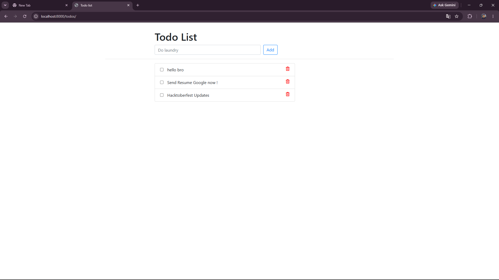

# Django Todo App — Dockerized

A fully containerized Django Todo application built with Docker.
Deployed and managed using Docker best practices.

## 🛠 Tech Stack
- Python 3.11
- Django 5.0.4
- Docker
- SQLite

## 🚀 Quick Start

### Prerequisites
- Docker installed on your machine

### Run Locally
```bash
git clone https://github.com/vedanttiwarij/django-todo-docker.git
cd django-todo-docker
docker build -t django-todo-app .
docker run -d -p 8000:8000 --name django-app django-todo-app
## 📸 Screenshot


## 👤 Author
**Vedant Tiwari**
- GitHub: [@vedanttiwarij](https://github.com/vedanttiwarij)